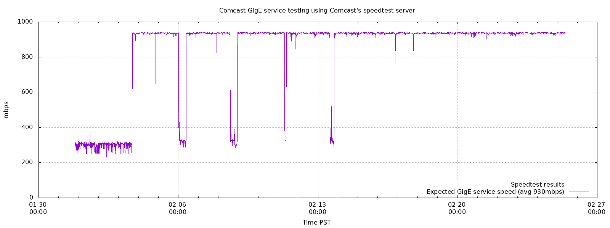

bwmon
=====

## Overview

Using the ookla CLI speed test program I crontab the app to take samples every 10 mins and output the the data from the speedtest app in json format.
I take that output and stuff right into postgres as a json formatted field
I use gnuplot to graph the data


### Step 1)
Download the ookla CLI speed test app, run and accept the user license agreement

* https://speedtest.net/apps/cli
* https://bintray.com/ookla/download/speedtest-cli#files
* https://bintray.com/ookla/download/download_file?file_path=ookla-speedtest-1.0.0-macosx.tgz

Here are some CLI Speed test examples, ensure you can reach a server:
* You'll want to run speedtest with "--servers" and select a different server that is closest to you. Ideally one that is hosted by your provider is best.
```
speedtest --server-id=1782 --format=json | jq
speedtest --server-id=1782 --progress=no -u auto-decimal-bits
speedtest --server-id=1782 --progress=no -u auto-decimal-bits -vvvv --output-header
```

### Step 2)
Install psql and setup db/table that we'll use.

CREATE SPEEDTEST USER AND DB
-----------------------------
```
CREATE ROLE speedtest WITH PASSWORD 'mysecretpass' LOGIN NOINHERIT NOCREATEROLE NOCREATEDB;
CREATE DATABASE speedtest WITH OWNER speedtest TEMPLATE template1;
COMMENT ON DATABASE speedtest IS 'Speedtest results tracking';
\q
	
CREATE CDR TABLES
psql -U speedtest speedtest
	
	
DROP TABLE samples ;
CREATE TABLE samples (
ID serial NOT NULL PRIMARY KEY,
ts timestamp with time zone DEFAULT now() NOT NULL,
data json NOT NULL
);
```

### Step 3)
create your Crontab entry:
```
*/10 * * * * /Users/osburn/speedtest/CRONTAB > /dev/null 2>&1
```

* Make sure you create the directory ~/graph or change that to where you want your graphs to be in gnuplot_comcast_bandwidth
* Also update the directory paths, as your login name and directory path is probably not "osburn" :)

### Example graph


